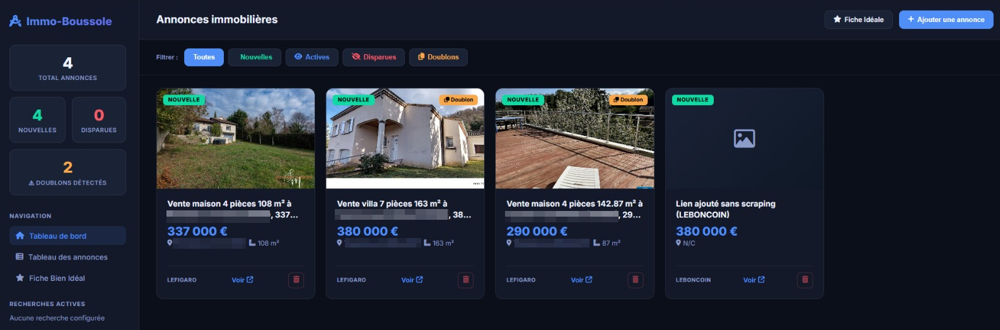
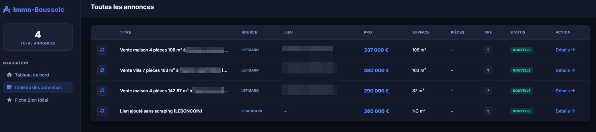
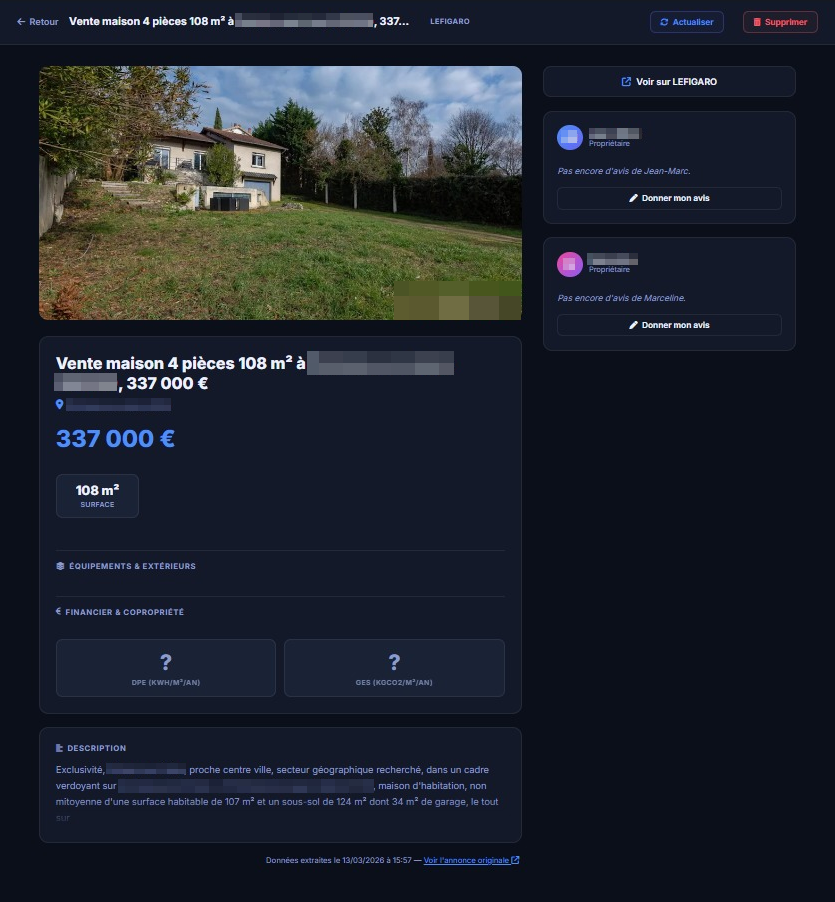

# 🧭 Immo-Boussole

[](https://github.com/Immo-Boussole/immo-boussole/actions/workflows/docker-publish.yml)
[](https://hub.docker.com/repository/docker/wikijm/immo-boussole/general)
[](https://hub.docker.com/r/wikijm/immo-boussole)
[](https://github.com/Immo-Boussole/immo-boussole/wiki)

> *Note : Ce projet cible principalement les plateformes immobilières françaises. / Note: At its core, this project targets French real estate platforms.*  
> 🇬🇧 **[English version available here (README.md)](README.md)**

**Immo-Boussole** est une application web collaborative moderne conçue pour centraliser, cataloguer, évaluer et suivre les offres immobilières sur plus de 10 plateformes (LeBonCoin, SeLoger, BienIci, LogicImmo, Le Figaro, etc.) de façon fluide et structurée.

---

## 📸 Aperçu de l'interface

| Tableau de bord | Liste des annonces | Fiche détaillée |
|---|---|---|
|  |  |  |

---

## 🚀 Fonctionnalités Clés

* **Scraping Multi-Plateformes Intelligent** : Extraction automatisée des prix, surfaces, DPE, taxes foncières, charges, géolocalisations et photos haute résolution sur plus de 10 sites :
  * *LeBonCoin, SeLoger, Le Figaro Immobilier, LogicImmo, BienIci, IAD France, Immobilier Notaires, Vinci Immobilier, Immobilier France, Provimo.*
* **Recherches Automatiques Planifiées** : Planificateur d'arrière-plan exécuté toutes les heures de 6h à 22h30 pour scraper vos recherches configurées ("Prêt à Rechercher").
* **Forcer la Recherche Immédiate** : Déclenchez un cycle de scraping complet à la demande sans attendre l'heure planifiée.
* **Stockage Local des Médias** : Photos téléchargées et servies en local pour garantir l'absence de liens cassés.
* **Avis Collaboratifs & Notes** : Notes individuelles multi-utilisateurs, critères d'évaluation, avantages et inconvénients pour chaque bien.
* **Synthèse IA "Bien Idéal"** : Profil dynamique calculé à partir des meilleures annonces pour révéler vos critères clés et points de vigilance.
* **Vue Carte Interactive** : Visualisation cartographique géographique des annonces actives, importées et nouvellement trouvées.
* **Assistant IA & Protocole MCP** : Assistant conversationnel intégré (Ollama) et serveur Model Context Protocol (MCP) pour vos outils LLM externes (Claude Desktop).
* **Intégrations Google** : Synchronisation des visites avec Google Calendar et des contacts d'agences avec Google Contacts.
* **Sauvegarde & Restauration** : Module administrateur pour exporter et réimporter l'intégralité de la base de données et des photos en un clic (archive ZIP).

---

## 📚 Documentation Complète & Guides (GitHub Wiki)

Tous les guides techniques de déploiement et de configuration sont réunis sur notre **[Wiki GitHub](https://github.com/Immo-Boussole/immo-boussole/wiki)** :

| Guide / Thème | Description | Lien |
|---|---|---|
| 🐳 **Déploiement Docker & Cloudflare** | Mise en production avec Docker Compose, Portainer et les tunnels Cloudflare Zero Trust | [Consulter le guide](https://github.com/Immo-Boussole/immo-boussole/wiki/Installation-Docker-FR) |
| 🛡️ **Proxy Résidentiel & Anti-Bot** | Déployer un proxy résidentiel (NAS Synology / Raspberry Pi) pour contourner les blocages DataDome / 403 | [Consulter le guide](https://github.com/Immo-Boussole/immo-boussole/wiki/Proxy-Setup-FR) |
| 🤖 **Assistant IA & Serveur MCP** | Connecter Ollama et exposer vos annonces à Claude Desktop via MCP | [Consulter le guide](https://github.com/Immo-Boussole/immo-boussole/wiki/MCP-Setup-FR) |
| 💾 **Sauvegarde & Restauration** | Procédures de backup et restore de la base SQLite et des médias | [Consulter le guide](https://github.com/Immo-Boussole/immo-boussole/wiki/Backup-Restore-FR) |
| 🔑 **Configuration Google OAuth2** | Configurer la synchronisation Google Calendar et Google Contacts | [Consulter le guide](https://github.com/Immo-Boussole/immo-boussole/wiki/Google-OAuth-Setup-FR) |

---

## ⚡ Démarrage Rapide

### 1. Avec Docker (Recommandé)

Immo-Boussole est entièrement conteneurisé et intègre le moteur de scraping sans tête **Browserless**.

#### Utiliser l'image officielle (Docker Hub)
```bash
docker compose -f docker-compose.hub.yml up -d
```

#### Construire depuis les sources
```bash
docker compose up -d --build immo-boussole
```

L'application est immédiatement accessible sur **[http://localhost:8000](http://localhost:8000)**.  
*Les données (base de données et photos) sont conservées en sécurité dans des volumes nommés Docker.*

---

### 2. Développement Local avec Python

#### Prérequis
* Python 3.10+
* Une instance [Browserless](https://www.browserless.io/) ou Chrome en local

```bash
# 1. Cloner le dépôt
git clone https://github.com/Immo-Boussole/immo-boussole.git
cd immo-boussole

# 2. Créer l'environnement virtuel
python -m venv venv
.\venv\Scripts\activate  # Sous Windows (ou source venv/bin/activate sous Linux/macOS)

# 3. Installer les dépendances
pip install -r requirements.txt

# 4. Configurer les variables d'environnement
cp .env.example .env

# 5. Démarrer le serveur
python -m uvicorn app.main:app --reload
```

---

## ⚙️ Configuration de l'environnement

Principales variables configurables dans `.env` :

| Variable | Valeur par défaut | Description |
|---|---|---|
| `SECRET_KEY` | *(requis)* | Clé secrète de signature des sessions et jetons. |
| `DATABASE_URL` | `sqlite:///./immo_boussole.db` | Chaîne de connexion SQLite. |
| `BROWSERLESS_URL` | `ws://localhost:3000` | Endpoint WebSocket du navigateur headless. |
| `BROWSERLESS_TOKEN` | *(vide)* | Jeton d'authentification optionnel pour Browserless. |
| `SCRAPING_SCHEDULE` | `"Toutes les heures, de 6h à 22h30"` | Texte descriptif du planning affiché dans l'UI. |
| `GEORISQUES_API_KEY` | *(optionnel)* | Clé API pour les risques naturels et technologiques français. |
| `OLLAMA_URL` | `http://host.docker.internal:11434` | Endpoint pour l'assistant IA Ollama. |
| `OLLAMA_MODEL` | `llama3` | Modèle utilisé pour le chat et l'analyse. |

---

## 🔌 Documentation de l'API & Swagger

Immo-Boussole intègre une API REST complète propulsée par **FastAPI** :

* **Interface interactive Swagger UI** : [http://localhost:8000/docs](http://localhost:8000/docs)
* **Documentation ReDoc** : [http://localhost:8000/redoc](http://localhost:8000/redoc)

---

## 🧪 Tests

Une suite de tests automatisés couvre les endpoints API, le scraping, la base de données et les intégrations :

```bash
# Lancer tous les tests
python tests/run_tests.py

# Mode CI (rapide)
python tests/run_tests.py --ci
```

---

## 🏗️ Stack Technique

* **Backend** : FastAPI (Python 3.12), SQLAlchemy ORM, SQLite, APScheduler, Pydantic v2
* **Scraping & Automatisation** : Playwright, Browserless, BeautifulSoup4, HTTPX
* **Frontend** : HTML5, Vanilla CSS (Design Sombre / Glassmorphism), Templates Jinja2
* **Intégrations** : Google Calendar API, Google People API, MCP (Model Context Protocol), API Géorisques, OpenStreetMap / Nominatim

---

## 📄 Licence

Ce projet est sous licence open-source. Voir le dépôt pour les détails.
