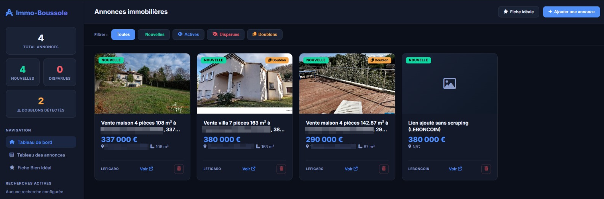
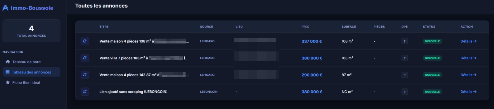
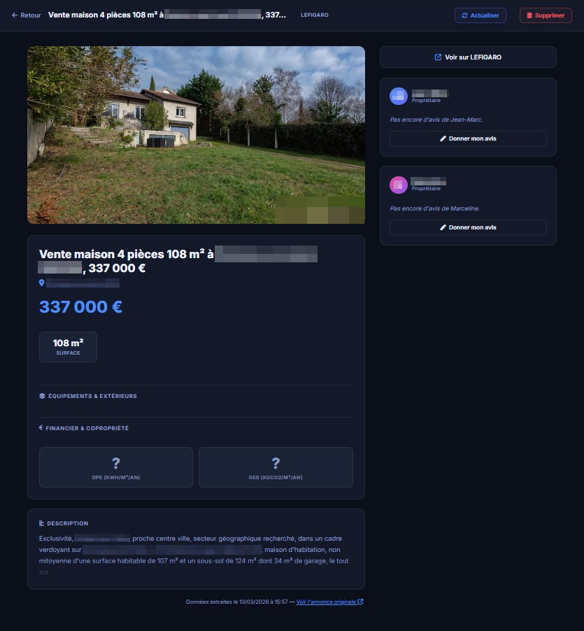
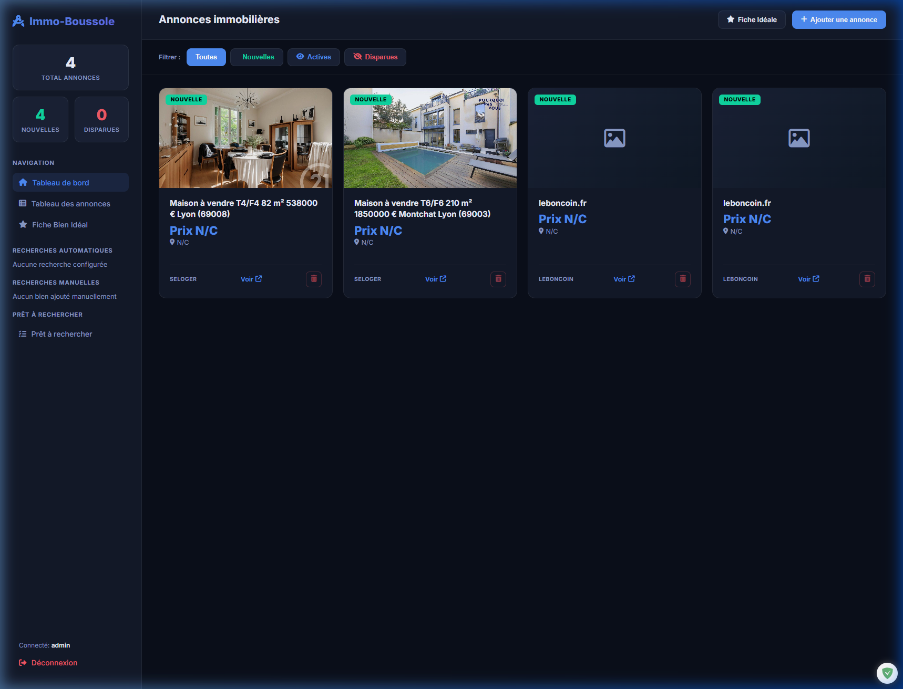
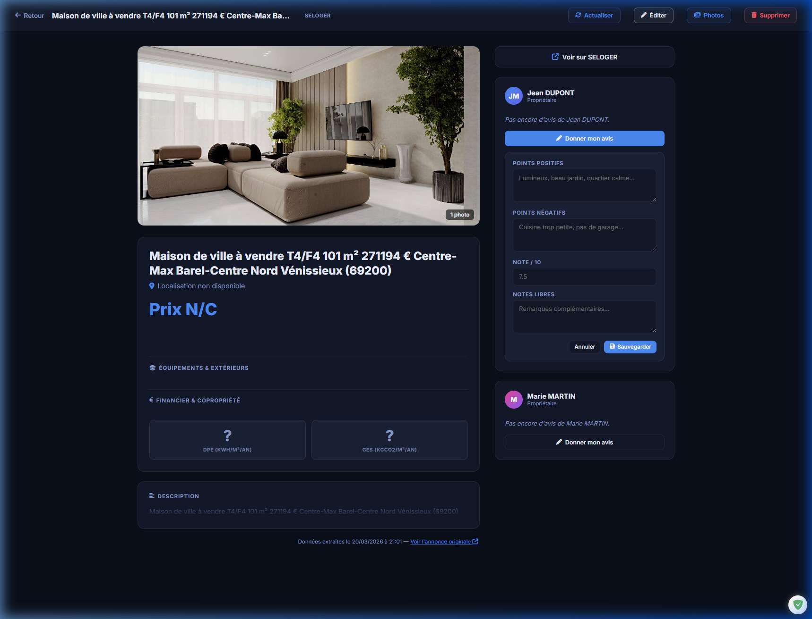
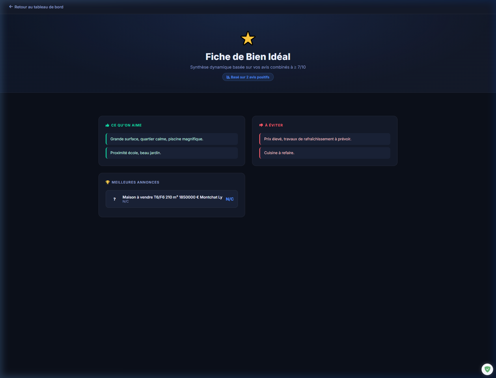
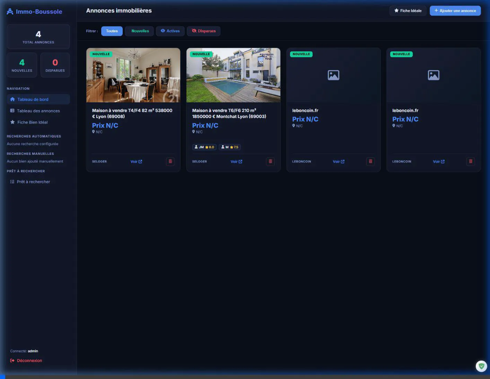
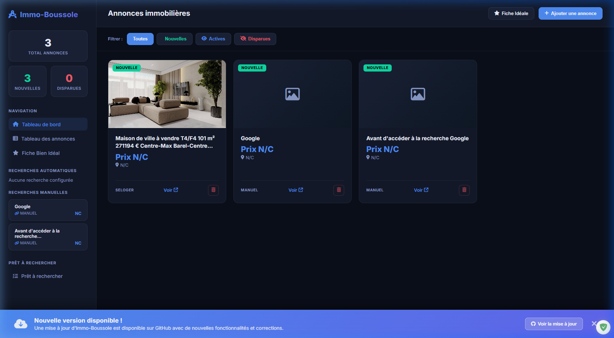

# 🧭 Immo-Boussole

[](https://github.com/Immo-Boussole/immo-boussole/actions/workflows/docker-publish.yml)
[](https://hub.docker.com/repository/docker/wikijm/immo-boussole/general)
[](https://hub.docker.com/r/wikijm/immo-boussole)

*Note: At its core, this project targets French platforms for property search. / Note : Ce projet cible à l'origine les plateformes immobilières françaises pour la recherche de biens.*

[Version française disponible ici](README.fr.md)

**Immo-Boussole** is a collaborative web application designed to centralize, catalog, and evaluate real estate listings (LeBonCoin, SeLoger, and 8+ more platforms) in a structured manner.





## 🚀 Key Features

- **Smart Scraping**: Automatic extraction of details (price, area, DPE, taxes, charges, photos) from over 10 platforms:
  - LeBonCoin, SeLoger, Le Figaro Immobilier, LogicImmo, BienIci, IAD France, Immobilier Notaires, Vinci Immobilier, Immobilier France.
- **Scheduled Auto-Search**: Automatic scraping of all "Ready to Search" entries, running **every hour from 6:00 to 22:30**. New listings appear in the "Automatic Searches" view, pre-tagged with their source platform and search criteria.
- **Force Search**: A button in the "Automatic Searches" view lets you trigger a full scraping cycle instantly, without waiting for the next scheduled run.
- **Local Media Management**: Photos are downloaded and served locally to avoid dead links.
- **Collaborative Reviews**: Separate rating and comment system.
- **Ideal Property Profile**: Generation of a dynamic profile based on top-rated listings (average price, area, recurring pros/cons).
- **Interactive Map**: Visualize all active and new listings on a geographic map.
- **Premium Interface**: Modern dark design, descriptive cards, photo carousels, and a secure delete button with confirmation (slide).

---

## ✨ Features Demonstration

The application is designed to optimize collaborative searching. Here is an overview of the main features:

### 📥 1. High-Quality Listings Import
Import active listings from **LeBonCoin** and **SeLoger**. The scraper automatically retrieves titles, descriptions, prices, areas, and high-resolution photos.


*Initial state of the dashboard after importing 4 listings.*

### 🤖 2. Automatic Searches & Scheduled Scraping
Configure your search URLs in the **"Ready to Search"** view (platform + criteria + URL). The scheduler will automatically scrape all configured searches every hour between 6:00 and 22:30. New listings appear in **"Automatic Searches"**, showing the source platform and criteria as the first two columns. A **"Force Search"** button lets you trigger a full cycle instantly.

### 📸 3. Interactive Photo Gallery
The detail page includes a responsive carousel and a premium "lightbox" gallery for an immersive view of the properties.


*Interactive demonstration of the carousel and gallery.*

### 👥 4. Collaborative Review System
The application allows multiple reviewers (e.g., **Jean DUPONT** and **Marie MARTIN**) to provide independent reviews, ratings, and notes on each property.



*Adding collaborative reviews and assigning ratings.*

### 🌟 5. "Ideal Property" Dynamic Profile
The application automatically synthesizes all highly-rated reviews to create your "Ideal Property" profile, highlighting recurring positive and negative points.



*Dynamic synthesis of reviews into a 'Perfect Match' profile.*

### 🛡️ 6. Secure "Slide to Delete"
To prevent accidental deletions, the interface uses a premium slide-to-confirm interaction.



*Demonstration of the secure slide-to-delete feature.*

### 🔔 7. New Version Alert
A banner automatically appears at the bottom of the home screen when a new version of the source code is available on GitHub.



*Preview of the banner indicating an available update.*

## 🛠️ Installation & Launch

### Prerequisites
- Python 3.10+
- A [Browserless](https://www.browserless.io/) instance (or Docker, which bundles it automatically) for full scraping.

### Local Installation
1. **Clone the project**
2. **Create a virtual environment**:
   ```bash
   python -m venv venv
   .\venv\Scripts\activate  # Windows
   ```
3. **Install dependencies**:
   ```bash
   pip install -r requirements.txt
   ```
4. **Configure the environment**:
   ```bash
   cp .env.example .env
   ```
5. **Start the server**:
   ```bash
   python -m uvicorn app.main:app --reload
   ```
   The application is accessible at [http://127.0.0.1:8000](http://127.0.0.1:8000).

---

## 🐳 Running with Docker

The project is fully containerized, automatically including the **Browserless** scraping engine. A pre-built image is available on [Docker Hub](https://hub.docker.com/repository/docker/wikijm/immo-boussole/general) and is automatically updated after each code modification via [GitHub Actions](.github/workflows/docker-publish.yml).

1. **Launch all services**:
   You can either build the image locally or use the pre-built image from Docker Hub:

   - **From source (local build)**:
     ```bash
     docker compose up -d --build immo-boussole
     ```
   - **From Docker Hub (pre-built)**:
     ```bash
     docker compose -f docker-compose.hub.yml up -d
     ```

   > [!TIP]
   > To update the application after a code change (when building locally), simply re-run:
   > `docker compose up -d --build immo-boussole`
   > The image will be updated with your changes, but **your data (database and photos) will remain intact** thanks to persistent volumes.

2. **Access**: The interface is available at [http://localhost:8000](http://localhost:8000).

3. **Persistence**: The database and media are stored in named volumes (`immo-boussole-db` and `immo-boussole-media`).

### 🌐 Advanced Deployment (Portainer & Cloudflared)

For secure production deployment on a remote server, you can use **Portainer** to manage your containers and **Cloudflared** (Cloudflare Zero Trust Tunnels) to securely expose the application to the Internet without opening ports.

👉 **See the detailed guide: [Installation via Docker, Portainer, and Cloudflared](INSTALL_Docker+Portainer+Cloudflared.en.md)**

---

## ⚙️ Environment Configuration

Key variables in `.env`:

| Variable | Default | Description |
|----------|---------|-------------|
| `SECRET_KEY` | *(required)* | Session encryption key. Change in production. |
| `DATABASE_URL` | `sqlite:///./immo_boussole.db` | Path to the SQLite database. |
| `BROWSERLESS_URL` | `ws://localhost:3000` | WebSocket URL for the headless browser. |
| `BROWSERLESS_TOKEN` | *(empty)* | Optional authentication token for Browserless. |
| `SCRAPING_SCHEDULE` | `"Toutes les heures, de 6h à 22h30"` | **Human-readable** cron description displayed in the UI next to the "Force Search" button. |
| `GEORISQUES_API_KEY` | *(optional)* | API key for the French Géorisques risk data service. |
| `APP_VERSION` | `1.1.1-dev` | Version string shown in the sidebar footer. |

---

## 🔒 Security & Authentication

Access to the application is protected by a multi-user authentication system with roles.

- **Initial Setup**: On the first run, the application redirects to `/setup-admin` to create the primary administrator account.
- **Session**: Sessions are secured using a `SECRET_KEY` (automatically generated or defined in `.env`).
- **Access Control**: Any unauthenticated access attempt redirects to the login page.

---

## 👥 User Roles & Permissions

The system distinguishes between two primary roles:

- **ADMIN**:
  - Access to the **User Management** interface (`/admin/users`).
  - Ability to create and delete user accounts.
  - **Restriction**: Cannot import or scrape new listings (to maintain focus on management).
- **USER**:
  - Full access to property searching and evaluation.
  - Ability to import listings via URLs or manual entry.
  - Access to the automatic search scheduling and force-search feature.
  - **Restriction**: No access to the administration panel.

---

## 📖 User Guide

1. **Add a property**: Click on "+ Add Listing" and paste the LeBonCoin or SeLoger URL.
2. **Set up auto-searches**: Go to **"Ready to Search"** and add a platform + criteria + URL. The scheduler will scrape it automatically every hour (6h–22h30).
3. **Review new auto-found listings**: Open **"Automatic Searches"** to see, import, or reject newly discovered properties. Use **"Force Search"** to trigger an immediate cycle.
4. **Review**: Click on a card to view details, then fill out your section.
5. **Delete**: On the dashboard, click the trash can icon on a card and slide to confirm.
6. **Ideal Profile**: Check the global synthesis via the sidebar to see what type of property fits you best.

## 🔌 API Documentation (REST)

The application exposes a comprehensive REST API built with **FastAPI**. All endpoints require authentication (active session) and return an HTTP 401 code in case of unauthorized access.

### Listings
- `GET /api/listings`: Retrieves the list of listings (optional filters: `status`, `source`, `limit`).
- `GET /api/listings/{listing_id}`: Retrieves full details of a specific listing.
- `POST /api/listings/submit-url`: Adds a new listing via a URL (automatically starts scraping).
- `POST /api/listings/{listing_id}/rescrape`: Manually triggers a scrape to update an existing listing.
- `PUT /api/listings/{listing_id}`: Manually updates the attributes of a listing.
- `DELETE /api/listings/{listing_id}`: Deletes a listing and its associated reviews.
- `POST /api/listings/{listing_id}/import`: Imports a listing (sets status to ACTIVE).
- `POST /api/listings/{listing_id}/reject`: Rejects a listing (sets status to REJECTED).
- `POST /api/listings/{listing_id}/photos`: Imports new photos from a list of URLs.
- `POST /api/listings/{listing_id}/photos/upload`: Directly uploads photos (Multipart Form).

### Automatic Searches
- `POST /api/searches/force`: **Triggers a full scraping cycle immediately** in the background (visible in the "Automatic Searches" view).

### Ready Searches
- `GET /searches/ready` *(page)*: Lists all configured search URLs.
- `POST /api/searches/ready`: Adds a new ready search (platform, criteria, URL).
- `PUT /api/searches/ready/{id}`: Updates an existing ready search.
- `DELETE /api/searches/ready/{id}`: Removes a ready search.

### Administration (Admin only)
- `GET /admin/users`: Interface for managing users.
- `POST /api/admin/users`: Creates a new user account.
- `DELETE /api/admin/users/{user_id}`: Deletes a user account.

### Reviews
- `GET /api/listings/{listing_id}/reviews`: Lists all reviews left on a listing.
- `POST /api/listings/{listing_id}/reviews`: Adds or updates a collaborative review.
- `PUT /api/reviews/{review_id}`: Modifies an existing specific review.
- `DELETE /api/reviews/{review_id}`: Deletes an existing review.

### Ideal Profile
- `GET /api/profile/ideal`: Returns the dynamic synthesis of the ideal property.

The API is also fully documented and testable via the integrated Swagger interface at [http://127.0.0.1:8000/docs](http://127.0.0.1:8000/docs).

## 🏗️ Project Structure

- `app/`: Backend logic (scrapers, models, API services, scheduler).
  - `main.py`: FastAPI routes and application entry point.
  - `models.py`: SQLAlchemy ORM models (Listing, ReadySearch, SearchQuery, …).
  - `services.py`: Scraping and listing creation business logic.
  - `scheduler.py`: APScheduler cron jobs (hourly 6h–22h30).
  - `database.py`: DB engine, session factory, and automatic migrations.
- `templates/`: Jinja2 HTML pages.
- `static/`: CSS assets and downloaded media (listing photos).
- `locales/`: Internationalization JSON files (`fr.json`, `en.json`).
- `tests/`: Unit and integration test scripts.
- `Dockerfile` & `docker-compose.yml`: Docker configuration.
- `immo_boussole.db`: SQLite database (managed automatically).
- `.ai/`: Specialized documentation and AI-related context.

## 🧪 Testing

The project includes a comprehensive testing framework to ensure stability:

- **Run all tests**: `python tests/run_tests.py`
- **CI Mode (Fast)**: `python tests/run_tests.py --ci`
- **Automated CI**: Managed via GitHub Actions on every push or manual trigger.

Detailed documentation is available in [.ai/TESTING.md](.ai/TESTING.md).

## 🏗️ Technical Stack
- **Backend**: FastAPI (Python 3.12)
- **Database**: SQLite + SQLAlchemy (Automatic migrations included, no Alembic required)
- **Scraping**: Playwright + Browserless / BeautifulSoup4 / HTTPX
- **Additional Scrapers**: Figaro and LogicImmo adapted from the [French-eState-Scrapper](https://github.com/Web3-Serializer/French-eState-Scrapper) project
- **Frontend**: HTML5 / Vanilla CSS / Jinja2
- **Scheduler**: APScheduler with `CronTrigger` (hourly runs, 6h–22h30)
- **Geo & Risk**: Nominatim (geocoding), OSRM (routing), Géorisques API (risk data)


## 🚀 Upcoming Features

- ✅ Protect access to the entire site with an authentication mechanism.
- ✅ Create an admin account setup system on first run.
- ✅ Create an administration interface.
- ✅ Create a user account system (admin cannot import listings).
- ✅ Make the application multilingual (French and English).
- ✅ Interactive map of listings.
- ✅ Automatic scheduled searches (hourly, 6h–22h30) from "Ready to Search" entries.
- ✅ "Force Search" button to trigger an immediate scraping cycle.
- ✅ Platform & criteria columns in the "Automatic Searches" view.
- ⬜ Create a real estate agent account system.
- ⬜ Add a favorite system for listings and searches.
- ⬜ Add a notification system (email, push, etc.).
- ⬜ Re-implement the duplicate detection mechanism.
